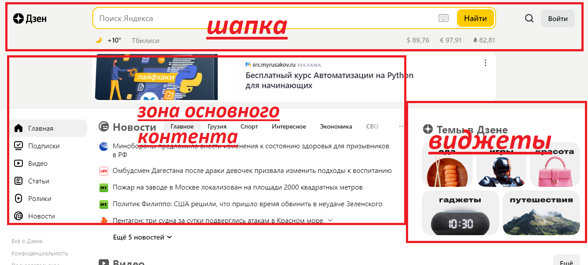
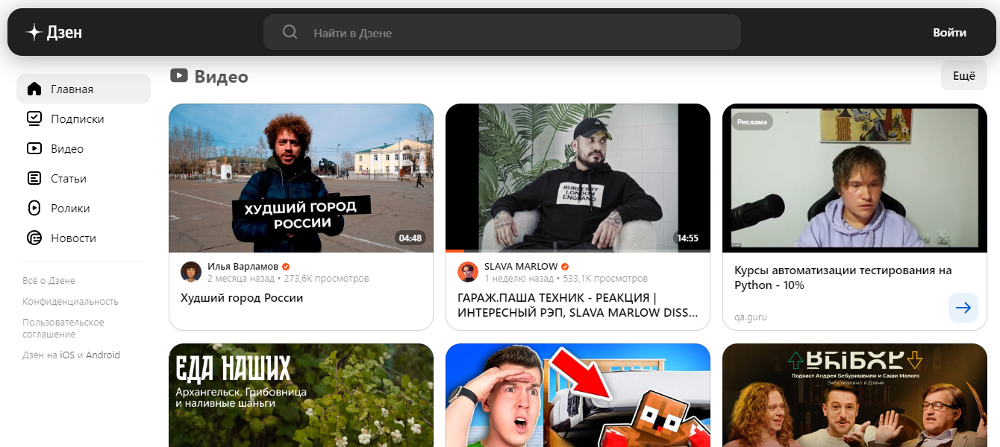
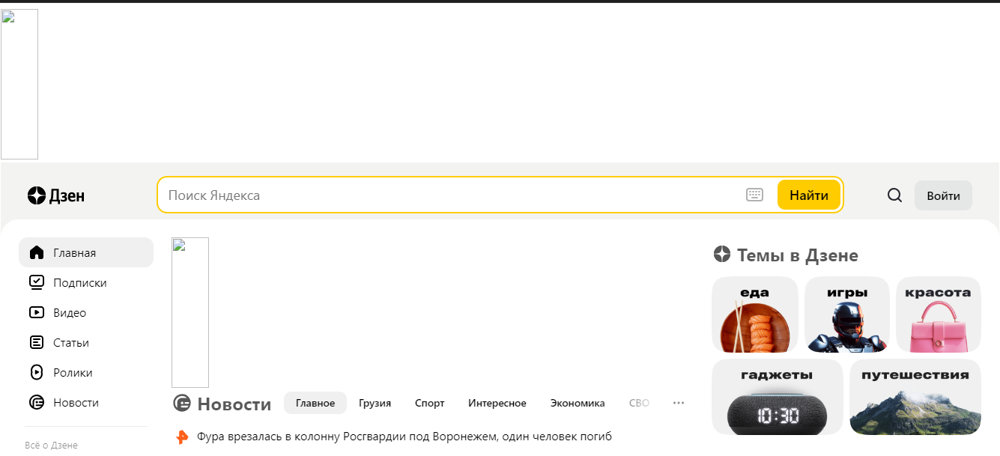

# Знакомство с веб-технологиями (семинары)

## Домашняя работа ко второму уроку
На примере файла read.me с 1 урока сделать простой сайт с использованием HTML и CSS. 

## Урок 1. Веб-технологии: вчера, сегодня, завтра

### Задача: на основе сайта [yandex.ru](https://dzen.ru/?yredirect=true) :
1. Определите, на каком протоколе работает сайт.
2. Проанализируйте структуру страницы сайта.
3. Внесите не менее 10 изменений на страницу с помощью инструмента разработчика и представьте скриншоты было/стало.

### Решение:

1. Данный сайт работает на защищенном,зашифрованном протаколе ***HTTPS***,что означает,что личные данные с данного сайта защищены, что можно видеть по URL сайта

2. При анализировании структуры сайта можно выделить
- шапку
- зону основного контента
- зону виджетов
- подвал

  Это можно видеть на картинках ниже

  
  

3. Для наглядного локального изменения страницы посмотрим на сайт до изменений :
 
 

   И после: 
  
  

  - был убран рекламный банер и строка с погодой
  - изменены разметка страницы,шрифты и  отсупы
  - выборочно удалены некоторые строки кода в бэкэнде